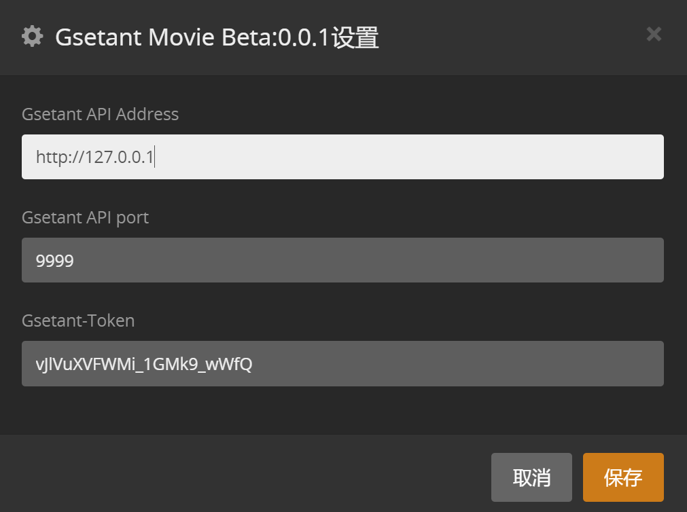

# Gsetant.bundle

#### Gsetant.bundle 为Gsetant的plex插件支持端。使用Gestant提供的服务需要在Plex服务器中正确安装和配置本插件。

#### Plex 插件安装和配置可参考[此链接](https://github.com/Tosslog/PlexMediaServer/wiki/Plex-%E6%8F%92%E4%BB%B6-%E5%AE%89%E8%A3%85%E4%B8%8E%E5%88%A0%E9%99%A4)

### 插件配置说明

Gsetant API Address: Gsetant 服务端地址。如果您使用公共Gsetant服务，这里需要填入`https://www.gsetant.xyz`

Gsetant API port: Gsetant 服务端端口号，默认9999。 如果您使用公共Gsetant服务，这里需要填入`443`

Gsetant-Token: Gsetant平台用户token，可在登录Gsetant后在个人中心生成获取

